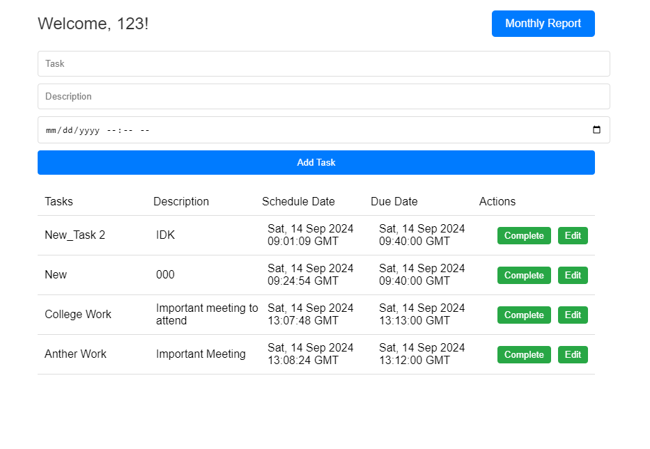

# To-do List (Technical Assignment)

## Discription
This is a simple to-do list application. It allows users to create, update, delete and view tasks. The application is built using ReactJS for the frontend, Python Flask for the backend and PostgreSQL for the database.

> Run this application on chrome browser for better experience.
> 
> Some functionalities may not work on other browsers.

| **Component**  | **Technology**  |
|----------------|-----------------|
| Frontend       | ReactJS          |
| Backend        | Python Flask     |
| Database       | PostgreSQL       |

### How to run application

1. Clone the repository

``` git clone https://github.com/bashlogs/To-do-List ```

2. Install react and python dependencies

``` 
yarn install 
pip install -r requirements.txt 
```
   
3. Edit the `.env` file in the root directory to add your database credentials
4. Dump the `database.sql` file in the root directory to your PostgreSQL database
5. To to start the application
```
python main.py
yarn start
```

### Database Design


### Flow Diagram


### Main Page
